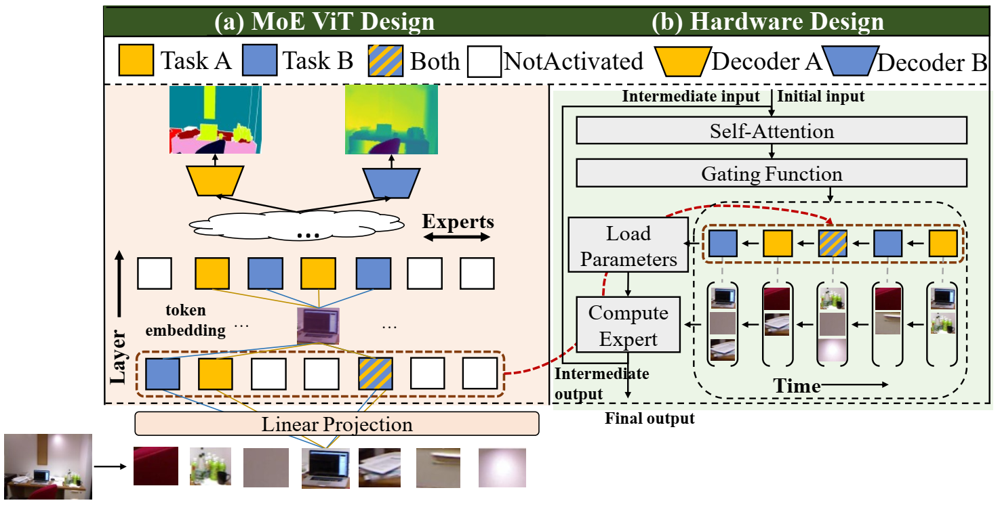
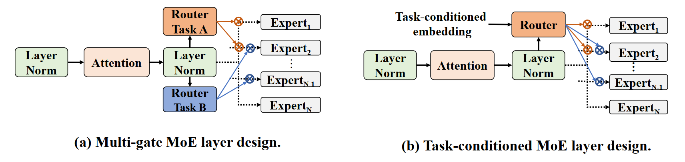
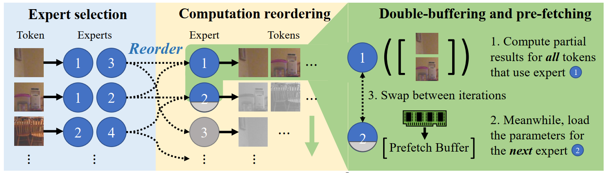

# M3ViT: Mixture-of-Experts Vision Transformer for Efficient Multi-task Learning with Model-Accelerator Co-design

<p align="center"> 
    
</p> 

### Abstract
Multi-tasking models have become successful and often essential for many sophisticated systems such as autonomous driving and indoor robots. However, when deploying MTL onto those real-world systems that are often resource-constrained or latency-sensitive, two prominent challenges arise: (i) during training, simultaneously optimizing all tasks is often difficult due to gradient conflicts across tasks, and the challenge is amplified when a growing number of tasks have to be squeezed into one compact model; (ii) at inference, current MTL regimes have to activate nearly the entire model even to just execute a single task. Yet most real systems demand only one or two tasks at each moment, while flexibly switching between tasks per need: therefore such ``all tasks activated'' inference is also highly inefficient and non-scalable in practice. 

In this paper, we present a model-accelerator co-design framework to enable efficient on-device MTL, that tackles both training and inference bottlenecks. Our framework, dubbed M^3ViT, customizes mixture-of-experts (MoE) layers into a vision transformer (ViT) backbone for MTL, and sparsely activates task-specific experts during training, which effectively disentangles the parameter spaces to avoid different tasks' training conflicts. Then at inference with any task of interest, the same design allows for activating only the task-corresponding sparse ``expert'' pathway, instead of the full model. Our new model design is further enhanced by hardware-level innovations, in particular, a novel computation reordering scheme tailored for memory-constrained MTL that achieves zero-overhead switching between tasks and can scale to any number of experts.

### Task-dependent MoE ViT Design
In Multi-gate MoE layer design, each task selects its experts using its own router. In Task-conditioned MoE layer design, all tasks share one router, while a task-specific embedding is concatenated with the token embedding to formulate the input of the shared router.

<p align="center"> 
    
</p> 

### Circuit-level Implementation
The MoE gating function selects K experts for each token, which are used to route tokens to per-expert queues. This is followed by a double-buffered computation flow that computes one expert’s results on its entire token queue while loading another expert’s parameters, swapping buffers between iterations.

<p align="center"> 
    
</p> 

## Installation
Assuming [Anaconda](https://docs.anaconda.com/anaconda/install/), the most important packages can be installed as:

```
conda install pytorch torchvision torchaudio cudatoolkit=11.1 -c pytorch -c nvidia
conda install imageio scikit-image     # Image operations
conda install -c conda-forge opencv           # OpenCV
conda install pyyaml easydict                   # Configurations
conda install termcolor                         # Colorful print statements
pip install easydict
pip install mmcv
pip install thop
pip install dm-tree
pip install timm
pip install Pillow==6.1
```
you also need to install fastmoe:

```
git clone https://github.com/laekov/fastmoe.git
cd fastmoe
git checkout 4edeccd
psudo() { sudo env PATH="$PATH" "$@"; }
psudo python setup.py install
```

## Usage
### Setup 
The following files need to be adapted in order to run the code on your own machine:
- Change the file paths to the datasets in `utils/mypath.py`, e.g. `/path/to/pascal/`.
- Specify the output directory in `configs/your_env.yml`. All results will be stored under this directory.
- The [seism](https://github.com/jponttuset/seism) repository is needed to perform the edge evaluation.
- If you want to use the HRNet backbones, please download the pre-trained weights [here](https://github.com/HRNet/HRNet-Image-Classification). 
The provided config files use an HRNet-18 backbone. Download the `hrnet_w18_small_model_v2.pth` and save it to the directory `./models/pretrained_models/`.

The datasets will be downloaded automatically to the specified paths when running the code for the first time.

### Training
The configuration files to train the model can be found in the `configs/` directory. The model can be trained by running the following command:

To run baseline models including resnet, hrnet
```shell
python main.py --config_env configs/env.yml --config_exp configs/$DATASET/$MODEL.yml
```

To run models based on vit and vit-moe
```shell
CUDA_VISIBLE_DEVICES=0,1 python -m torch.distributed.launch --nproc_per_node=2 --master_port 3350 train_fastmoe.py --config_env configs/env.yml --config_exp configs/$DATASET/vit/$MODEL.yml --save_dir /output_dir 

CUDA_VISIBLE_DEVICES=0,1 python -m torch.distributed.launch --nproc_per_node=2 --master_port 3350 train_fastmoe.py --config_env configs/env.yml --config_exp configs/$DATASET/vit_moe/$MODEL.yml  --pretrained /home/pretrain_dir  --moe_gate_type "noisy_vmoe"  --moe_experts 16 --moe_top_k 4 --pos_emb_from_pretrained True --backbone_random_init False --vmoe_noisy_std 0 --gate_task_specific_dim -1 --save_dir /home/output_dir --task_one_hot False --multi_gate True --moe_mlp_ratio 1

```
### Evaluation
We evaluate the best model at the end of training. To speed-up training, it is possible to evaluate the model only during the final 10 epochs by adding the following line to your config file:

```python
eval_final_10_epochs_only: True
``` 

## References
This code repository is heavily based on the [ASTMT](https://github.com/facebookresearch/astmt) and [Multi-Task-Learning-PyTorch](https://github.com/SimonVandenhende/Multi-Task-Learning-PyTorch) repository.
 
<!-- ## Citation
If you find this repo useful for your research, please consider citing the following works:

```
@article{
  author={S. Vandenhende and S. Georgoulis and W. Van Gansbeke and M. Proesmans and D. Dai and L. Van Gool},
  journal={IEEE Transactions on Pattern Analysis and Machine Intelligence}, 
  title={Multi-Task Learning for Dense Prediction Tasks: A Survey}, 
  year={2021},
  volume={},
  number={},
  pages={1-1},
  doi={10.1109/TPAMI.2021.3054719}}

@article{vandenhende2020mti,
  title={MTI-Net: Multi-Scale Task Interaction Networks for Multi-Task Learning},
  author={Vandenhende, Simon and Georgoulis, Stamatios and Van Gool, Luc},
  journal={ECCV2020},
  year={2020}
}

@InProceedings{MRK19,
  Author    = {Kevis-Kokitsi Maninis and Ilija Radosavovic and Iasonas Kokkinos},
  Title     = {Attentive Single-Tasking of Multiple Tasks},
  Booktitle = {IEEE Conference on Computer Vision and Pattern Recognition (CVPR)},
  Year      = {2019}
}

@article{pont2015supervised,
  title={Supervised evaluation of image segmentation and object proposal techniques},
  author={Pont-Tuset, Jordi and Marques, Ferran},
  journal={IEEE transactions on pattern analysis and machine intelligence},
  year={2015},
}
``` -->
